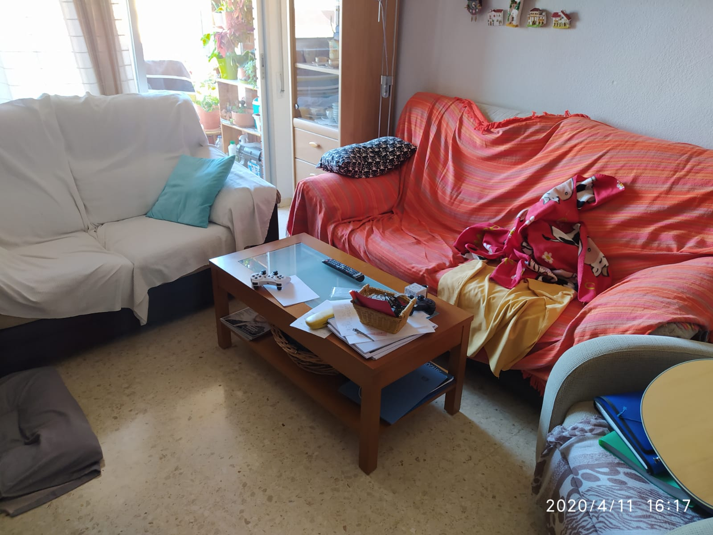

# 3D-model-From-Single-image
A 3D implementation of the mono-depth neural network for modeling estimation.

Following my last repostery (https://github.com/diegobonilla98/Depth-Estimator-From-Single-Image) I've used the same neural network to estimate a point-cloud 3D model from the output depth-map.

In the **point_cloud_from_image.py** script is a rather naïve approach using the matplotlib 3D library. The problem was (maybe in my lack of knowledge of the library) that the 3D scatter plot almost killed my PC for it was very very very unoptimized...

My interest in the matter was almost dead when I've found a Medium article (which I won't mention because the subject doesn't have anything in common with this) that mentioned a Python library called Open3D. I went quick to the documentation page and spend some hours converting my data to something that can be represented in a mesh. Well boys, we did it. In the **new_mesh.py** script is the nice nice new implementation using the cool algorithms.

###### The input
An image is sent to the neural network from my last repo (not included in this one) to estimate the depth-map. This returns a black and white image.

###### The output
The image represents a W, H, C tensor (Width, Height and Color or "how close"). For a 3D representation, the W and H represents the range of the X and Y axis, and C where the point locates in the Z one. A couple of tweaks for matching the Open3D language and all set.

Also, the library used offers saving the data to a file so you can import it with your prefered 3D software (being mine Blender, of course) and have a base model to work.
I have to insist that all of this comes from a **single image** which for anyone will come as witchcraft. What a time to be alive.

